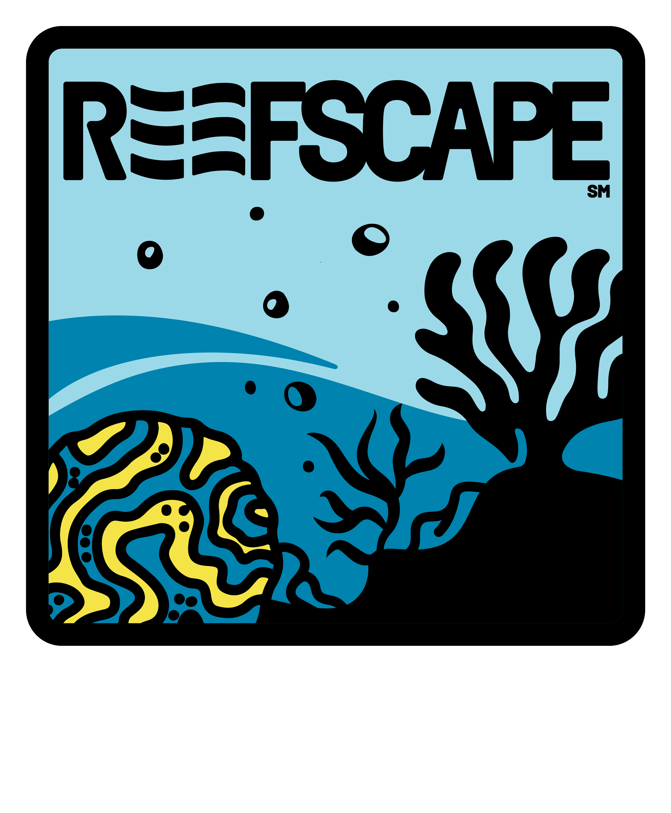

The Huntington Robotics 2025 build season officially kicks off on **January 4th from 12-2pm** with the reveal of FIRST Robotics Competition's season theme *Reefscape*.

From the FRC website:
> Beneath the ocean’s surface lies our planet’s most complex ecosystems, full of life and potential for exploration and learning, where each inhabitant has a role to play in building a thriving environment. During the 2024-2025 FIRST season, FIRST® DIVE℠ presented by Qualcomm, teams will use their STEM and collaboration skills to explore life beneath the surface of the ocean. Along the way, we’ll uncover the potential in each of us to strengthen our community and innovate for a better world with healthy oceans.

At this event, team members will learn about this year's competition rules and will begin to brainstorm how to solve these challenges. Over the following six weeks, the team will prototype, build and program their new robot as they prepare for their first competition in Februrary.

The kickoff will take place in the Huntington High School auditorium.

