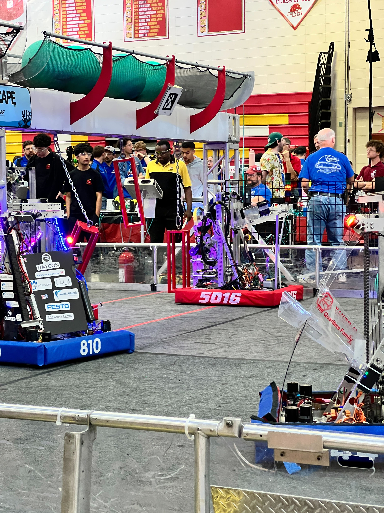
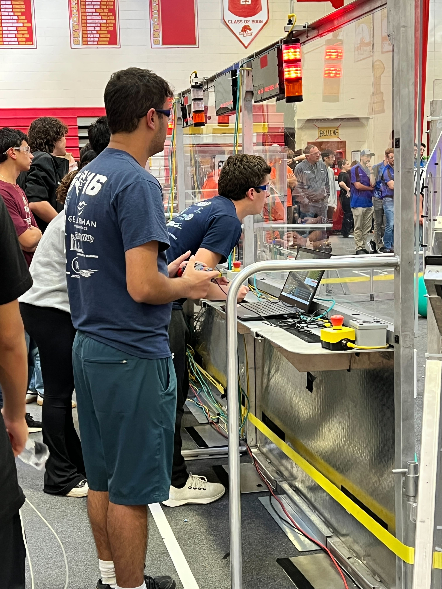
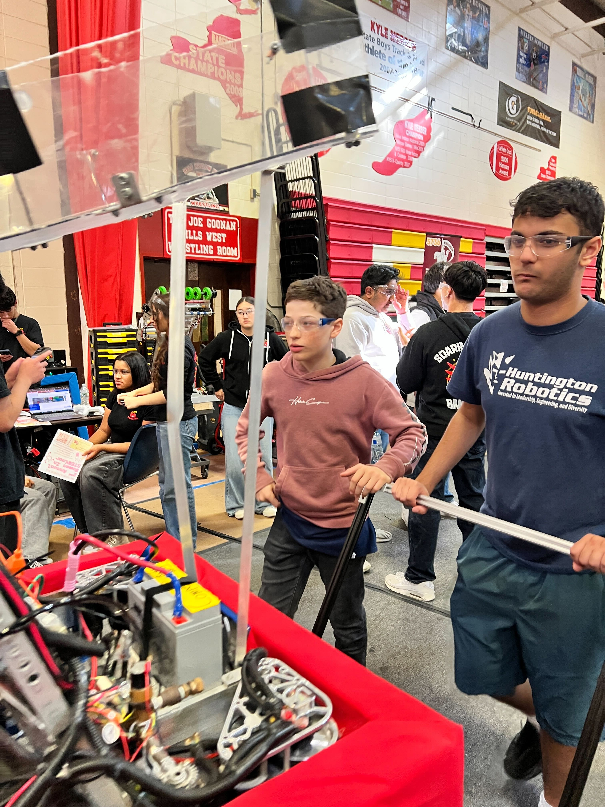
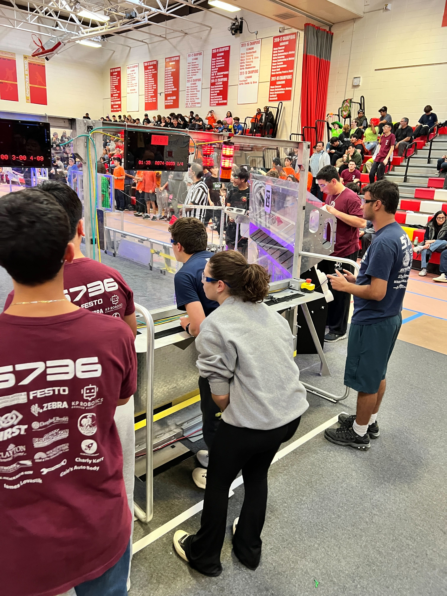
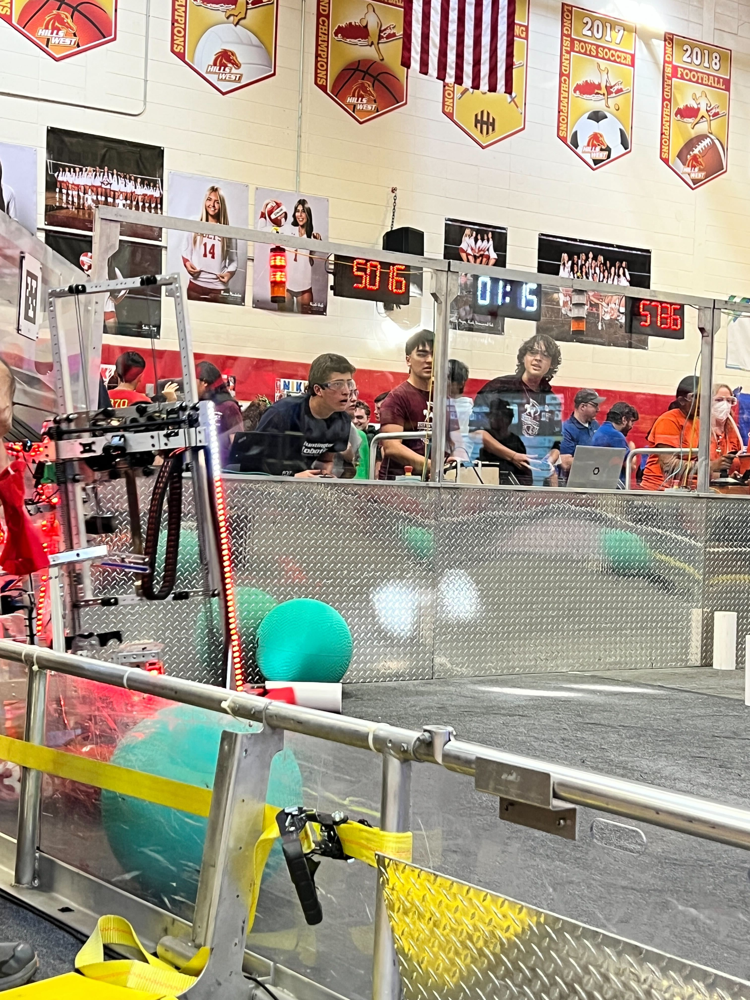

Team 5016 participated in the 13th annual Ken Vessey Half Hollow Hills Invitational on October 26th at Half Hollow Hills High School West. It was a thrilling competition and gave new team members the chance to experience the highs and lows of competition. Using their Reefscape robot from last season, the team competed in five qualifying matches, and in the playoffs was picked by Alliance 3 captain Kings Park Kingsman (the winners of the Hofstra Regional this past spring) and the Syosset JBirds. The alliance ended the day in fourth place after a set of exciting and competitive playoff matches.

"It was a great experience for all the new members of our team," said faculty sponsor Omar Santiago. "I'm glad they were able to participate on the drive team and see what it’s like to be in a real match."

The event was covered by [News12](https://longisland.news12.com/future-engineers-from-li-face-off-at-first-robotics-competition) and even features some cameos of the team.

Congrats to the new and existing members of Team 5016!

