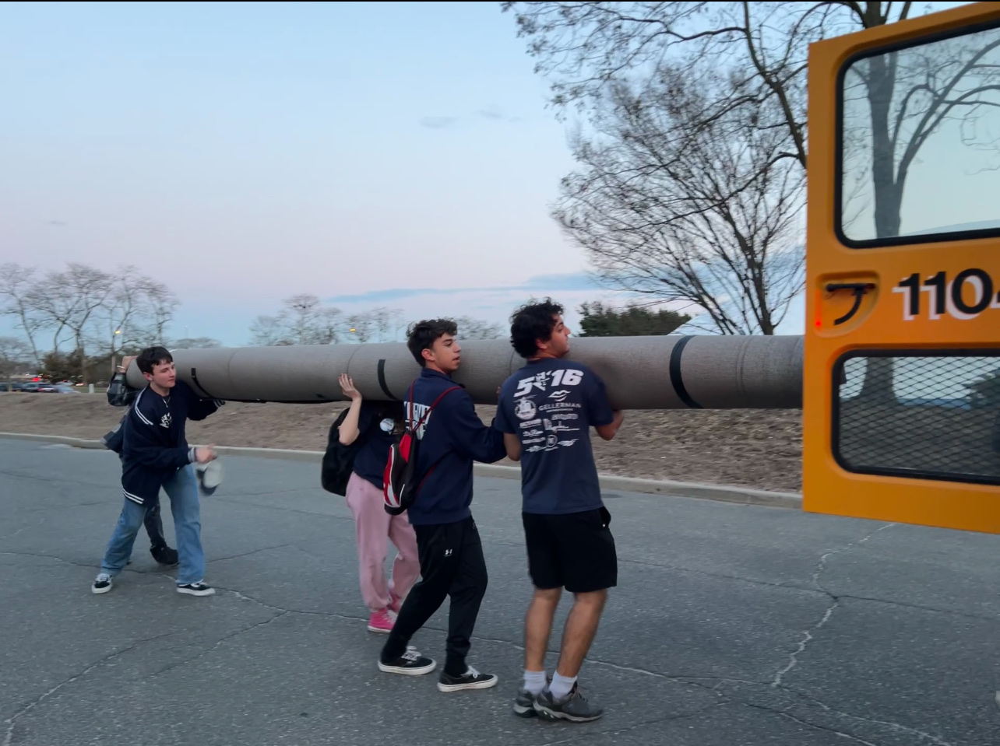

The Blue Devils continued their impressive season this past weekend with a second consecutive playoff appearance at the FIRST Long Island Regional competition at Hofstra. A combination of consistent scoring and excellent control and coordination by the drive team saw the team rise up to 5th place in the rankings at the end of the first day of competition.

The second day proved more challenging as the team faced difficult alliances and encountered some mechanical issues, but ultimately the team was well-placed by the end of qualification. Selected by Alliance 8 (Teams 810 and 2875), the group played well against strong alliances. Though eliminated, the team was proud to again reach the playoffs and represent their school.

[Click here](https://www.youtube.com/watch_videos?video_ids=_IwWr0fxq-Q,BL8_BXpKrJI,Jt2QGVqKmKY,HGBMuNibv7c,rkm_ae2iluc,F7wFLg7-QL4,cGkJblvNbKM,xri8rJsN7Wg,mIkIgI2X1Ik,avtDQHg6jrU,1v_gDb8ttN4,D_15bbDKvto&title=FIRST%20Long%20Island%20Regional%20(Team%205016)) to watch recordings of each of Team 5016's matches.

**Next Up:** The team heads into the offseason with additional R&D projects as well as planning for end-of-year events.

Above: The team takes home a souvenir from the playing field: a section of carpet, which is useful for in-house testing and practice.
