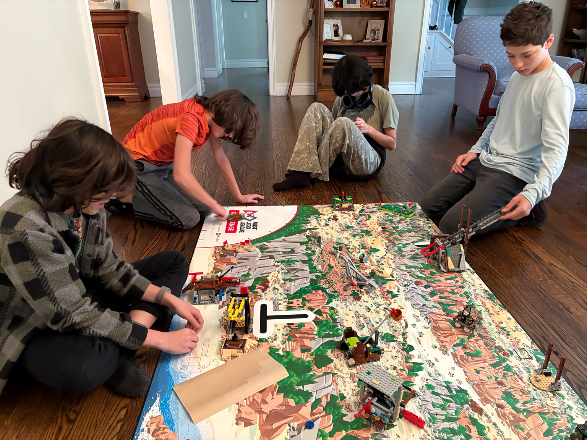

---

*New members of Team 5016 dive into the FLL field kit build*

This weekend the newest young members of FRC Team 5016 Huntington Robotics gathered in a living room that quickly transformed into a hive of energy, teamwork and nostalgia. For these students this was more than a casual get-together. It was a chance to give back to the FIRST LEGO League community that shaped their own journey.

Not long ago these same students were known as the Dragon Racers, a middle school FLL team that rose through the Long Island ranks to become regional champions. Their success earned them the honor of representing Long Island at the world competition. That experience lit a spark for many of them. Today that spark has grown into a commitment to help the next generation of FLL teams find their own path.

*Careful hands make sure every mission model is in the right place*

*The full group gathers around the Unearthed challenge field*

On this particular afternoon they rolled up their sleeves and got to work building the official FLL competition kit for the upcoming season. Their goal was simple. Create a fully assembled, field-ready mission model set that middle school teams across Long Island will use at official qualifying events.

What unfolded was the best of what youth robotics represents. Focused teamwork, shared problem solving, patience when a piece did not quite fit. Laughter when someone remembered a trick from their FLL days. Mentorship happening naturally in a room filled with peers who once stood exactly where today’s elementary and middle school teams now stand.

*Every mission model matters for the teams who will compete on this field*

*An overhead view of the build in progress*

The build took time and plenty of hands but no one rushed the process. Every student understood that the accuracy and stability of these mission models matter for hundreds of competitors. More than anything they remembered what it felt like to compete on a well-built field as younger students. Their effort now ensures that this year’s crop of Long Island FLL teams will have the same positive experience.

For Team 5016 this is a meaningful part of their outreach mission. Helping to build the region’s official FLL kits directly supports the volunteers and organizers who keep the program running. It also shows younger students that robotics is more than a competition. It is a community built on generosity, learning and leadership.

*Former Dragon Racers do their preseason work here, but expect to see them volunteering at upcoming FLL events too*

*Attention to detail helps official events run smoothly*

Perhaps the most inspiring part of the day was the quiet pride in the room. These students are not far removed from their FLL years yet here they are already giving back. Already modeling the values that make FIRST so special. Already paying forward the mentorship that guided them.

*From Long Island champions to community builders in just a few seasons*

As the final mission models clicked into place the room looked like a scene from their own Dragon Racers past. The difference now is that they are the ones paving the way. The students who once arrived at FLL tournaments full of excitement are now helping to create that same excitement for others.

Long Island’s FLL community and Team 5016 is stronger because of them. The spirit of the Dragon Racers lives on in every mission model they built this weekend and in the leaders they are becoming.
