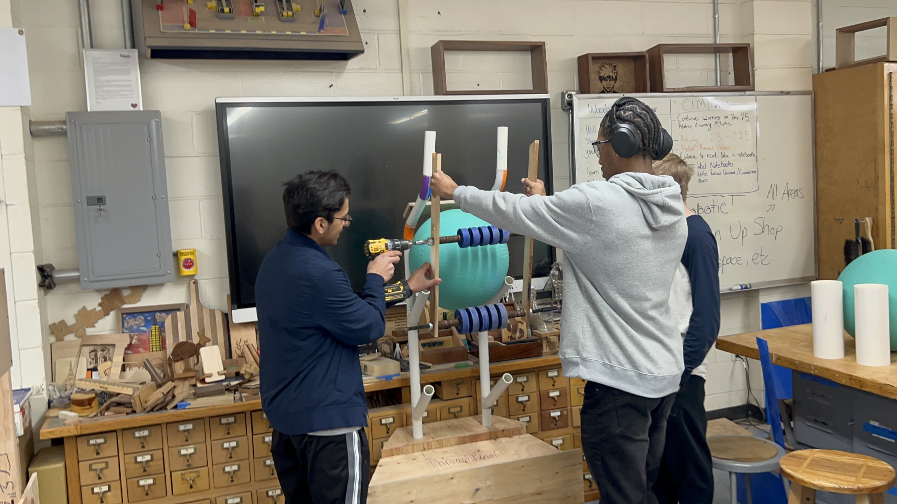

Huntington Robotics Team 5016 reached out to supporters last weekend with an update message, filling in school and community members with the latest information on the organization, which is two weeks into its competitive build season.

Team captain Jaipreet Singh penned an email designed to bring those interested in the Blue Devil robotics program up to speed. “Something new that we are trying is to create a CAD (computer-aided design) model of our robot,” Mr. Singh said. “This will allow us to build, test and demonstrate possible prototypes/mechanisms for this year’s competition. So far our team has been creating several models that we can interact with the different game elements using various tools and machines.”

On Sunday, January 26, Huntington Robotics with partner with the Finley Middle School robotics team to host the Vex IQ tournament in the high school’s Louis D. Giani Gymnasium. The event will run from 8 a.m. to 4 p.m. and bring 44 teams from across Long Island together for a challenging competition.

Mr. Singh explained the Vex IQ tournament will involve a “rapid relay” on a 6’x8’ rectangular field. “Two robots compete in the teamwork type challenge that lasts 60 seconds long,” he said. “In addition to the skills match, teams can also run autonomous programs to garner awards in programming. Make sure to say hi to us as we will be volunteering as resetters, queuing personnel and field managers. As always, we are excited to be hosting this event and look forward to seeing you.”

__Originally posted on [hufsd.edu](https://www.hufsd.edu/posts/2025/January/21a.html)__
